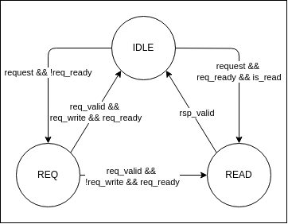

# Virtual JTAG Host

This project implements an interface using Altera Virtual JTAG to directly read and write on-chip memory in an FPGA design.
So you can use Altera USB blaster to access your on-chip memory system (e.g., BRAM, registers, etc.).

## Block Diagram

```text
    +---------------------+                 +---------------------+                 +---------------------+
    |     Host (PC)       |   USB-Blaster   |   Virtual JTAG TAP  |  Control FSM    |   On-Chip Memory    |
    |  vjtag_host.py      | --------------> |  (vjtag_interface)  | --------------> |    (Dual Port RAM)  |
    +---------------------+                 +---------------------+                 +---------------------+
```

## How it work

- The Virtual JTAG (VJTAG) megafunction exposes a TAP (Test Access Port) via USB-Blaster.
- Inside the FPGA, a custom finite state machine (FSM) decodes VJTAG commands and executes read/write operations
- The host program communicates via USB-Blaster using the Quartus JTAG API or Python-JTAG tools.

## Command Protocol

### VJTAG Transaction Format

Each transaction sent from the host follows this format:

```
Command - Address - Data
```

- Command: 1 byte. Specifies the operation type (e.g., read, write).
- Address: AW byte. Target memory address.
- Data: DW byte. Optional write data.
- Lengths for `Address (AW)` and `Data (DW)` are configurable via Verilog parameters in the FPGA design.

### Supported Commands

| Command            | CMD ID | Description                              |
| ------------------ | ------ | ---------------------------------------- |
| IDLE               | 0x00   | IDLE command. Used to read the data back |
| Single Read        | 0x01   | Single read operation                    |
| Single Write       | 0x02   | Single write operation                   |
| Reset Assertion    | 0xFE   | Assert the reset output                  |
| Reset De-assertion | 0xFF   | Deassert the reset output                |

## Implementation

### Parameter

| Name | Description       |
| ---- | ----------------- |
| `AW` | Bus Address width |
| `DW` | Bus Data width    |


### Interface

| Name        | Direction | Width     | Description             |
| ----------- | --------- | --------- | ----------------------- |
| `clk`       | Input     | 1 bit     | Clock signal            |
| `rst_n`     | Input     | 1 bit     | Active-low reset input  |
| `rst_n_out` | Output    | 1 bit     | Active-loe Reset output |
| `address`   | Output    | `AW` bits | Memory address output   |
| `wvalid`    | Output    | 1 bit     | Write request valid     |
| `wdata`     | Output    | `DW` bits | Write data              |
| `wready`    | Input     | 1 bit     | Write ready from memory |
| `rvalid`    | Output    | 1 bit     | Read request valid      |
| `rready`    | Input     | 1 bit     | Read ready from memory  |
| `rrvalid`   | Input     | 1 bit     | Read response valid     |
| `rdata`     | Input     | `DW` bits | Read data               |


### Design Implementation

#### VJTAG Interface: IR and DR

In this design, the **Instruction Register (IR)** holds the bus command (e.g., read or write), and the **Data Register (DR)**
holds the remaining transaction data, including the address and optional write data.

A typical data transaction from host machine to FPGA is as follows:
- The host loads the bus command into the **IR**.
- While the `sdr` signal is asserted, the remaining transaction fields (e.g., address and write data) are shifted into the **DR** via the `tdi` pin.
- Once shifting is complete, `sdr` is deasserted and `udr` is asserted, indicating the update of the **DR** register.

When a transaction is sent from the host machine:

⚠️ Note: The `tck` signal toggles only during active data shifting. Once `udr` is asserted, `tck` remains idle until the next transaction begins. `udr` also remains asserted until the next transaction begins.

##### Example Simulation Waveform


In this example:
- `tck` toggles during data shift-in.
- `udr` is asserted after the shift completes.
- `tck` remains idle during udr and resumes toggling on the next request.

#### Bus Access State Machine

After all required values are captured through IR and DR, the assertion of `udr` triggers a clock domain crossing (CDC)
to synchronize the transaction into the main clk domain. A state machine then handles bus access logic based on the request.

##### State Diagram



##### State Description

| State  | Description                            |
| ------ | -------------------------------------- |
| `IDLE` | Default state, waits for a request.    |
| `REQ`  | Waits for request handshake completion |
| `READ` | Waits for the read data                |

##### State Transition

| From   | To     | Condition                                                  | Description                                                      |
| ------ | ------ | ---------------------------------------------------------- | ---------------------------------------------------------------- |
| `IDLE` | `REQ`  | `request && ((wvalid && !wready)\|\| (rvalid && !rready))` | New request arrived but not accepted yet. Wait for ready signal. |
| `REQ`  | `IDLE` | `wvalid && wready`                                         | Write request accepted. Return to `IDLE`.                        |
| `REQ`  | `READ` | `rvalid && ready`                                          | Read request accepted. Wait for read data.                       |
| `IDLE` | `READ` | `request && rvalid && rready`                              | Read request accepted. Proceed to wait for read response.        |
| `READ` | `IDLE` | `rrvalid`                                                  | Received read data, go back to `IDLE` state                      |

#### Read data

To access read data from the FPGA via the VJTAG interface:

- Capture Phase: when the read response becomes available in the logic domain, it is stored in register and loaded to
`DR` register when `cdr` is asserted.
- Shift Phase: After capturing, the host begins reading the data by asserting `sdr`. The data is then serially shifted
out through `tdo` pin.

#### Clock Domain Crossing (CDC) between TCK and CLK

The VJTAG interface is running in the **TCK** clock domain while the system logic and bus is running at the functional
*CLK* domain. Therefore, CDC logic is required.

##### TCK -> CLK (VJTAG to Functional Logic)

When VJTAG completes data shifting, `udr` is asserted and `tck` becomes idle. A typical 4-phase handshake won't work
with this scheme.

Instead of using 4-phase handshake, `udr` is synchronized to `CLK` domain. A one clock pulse is generated from the
synchronized `udr` and used as qualifier to capture the IR and DR to CLK domain register.

##### CLK -> TCK (Read data to VJTAG)

In regular case, the read data is available few clocks after the read request. It is then stored in register within CLK domain

When VJTAG issue IDLE request to read the data back comes, the data is considered quasi-static so there is no special CDC logic required. The data can be considered as quasi-static because it will not change during this operation.

## References

**Altera Virtual JTAG**

- [Intel Virtual JTAG User Guide](https://www.intel.com/content/www/us/en/docs/programmable/683297/)

**Altera TCL programming**

- [Intel Quartus Prime Standard Edition User Guide: Scripting](https://www.intel.com/content/www/us/en/docs/programmable/683325/18-1/command-line-scripting.html)
- [Intel TCL Commands and Packages](https://www.intel.in/content/www/in/en/programmable/quartushelp/current/index.htm#tafs/tafs/tafs.htm)