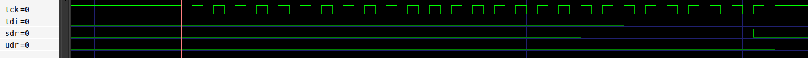

# VJTAG Implementation

- [VJTAG Implementation](#vjtag-implementation)
  - [Introduction](#introduction)
  - [vjtag2\_ctrl Implementation](#vjtag2_ctrl-implementation)
    - [Parameter](#parameter)
    - [Interface](#interface)
    - [Design Implementation](#design-implementation)

## Introduction

This document describe the **VJTAG Host** implementation.

The design is divided into 3 parts:

1. [vjtag_ip.sv](../rtl/vjtag/vjtag_ip.v)

    This is the Virtual JTAG IP from Altera. Generated by Quartus tool.

2. [vjtag_ctrl.sv](../rtl/vjtag/vjtag_ctrl.sv)

   Interfaces with vjtag_ip. Receives commands from vjtag_ip and converts them into a generic bus requests.

3. `vjtag2\<bus\>.sv`

   Top level module that convert the internal generic bus to a specific bus protocol.

   Currently supported bus protocol:
    - wishbone: [vjtag2wb.sv](../rtl/vjtag/vjtag2wb.sv)

This document discuss the `vjtag_ctrl.sv` Implementation in details.

## vjtag2_ctrl Implementation

### Parameter

| Name         | Description       |
| ------------ | ----------------- |
| `ADDR_WIDTH` | Bus Address width |
| `DATA_WIDTH` | Bus Data width    |

### Interface

| Name        | Direction | Width     | Description                       |
| ----------- | --------- | --------- | --------------------------------- |
| `clk`       | Input     | 1 bit     | Clock signal                      |
| `rst_n`     | Input     | 1 bit     | Active-low reset input            |
| `rst_n_out` | Output    | 1 bit     | Active-loe Reset output           |
| `req_valid` | Output    | 1 bit     | request valid                     |
| `req_write` | Output    | 1 bit     | 0: read request. 1: write request |
| `req_addr`  | Output    | `AW` bits | address. **Aligned to Byte.**     |
| `req_wdata` | Output    | `DW` bits | Write data                        |
| `req_ready` | Input     | 1 bit     | bus ready from device             |
| `rsp_valid` | Input     | 1 bit     | Response valid                    |
| `rsp_rdata` | Input     | `DW` bits | Read data                         |

> ⚠️ Note: The req_addr is aligned to byte.

### Design Implementation

#### VJTAG Interface: IR and DR

In this design, the **Instruction Register (IR)** holds the bus command (e.g., read or write), and the **Data Register (DR)**
holds the remaining transaction data, including the address and optional write data.

A typical data transaction from host machine to FPGA is as follows:
- The host loads the bus command into the **IR**.
- While the `sdr` signal is asserted, the remaining transaction fields (e.g., address and write data) are shifted into the **DR** via the `tdi` pin.
- Once shifting is complete, `sdr` is deasserted and `udr` is asserted, indicating the update of the **DR** register.

When a transaction is sent from the host machine:

> ⚠️ Note: The `tck` signal toggles only during active data shifting. Once `udr` is asserted, `tck` remains idle until the next transaction begins. `udr` also remains asserted until the next transaction begins.

##### Example Simulation Waveform

In this example:
- `tck` toggles during data shift-in.
- `udr` is asserted after the shift completes.
- `tck` remains idle during udr and resumes toggling on the next request.

#### Bus Access State Machine

After all required values are captured through IR and DR, the assertion of `udr` triggers a clock domain crossing (CDC)
to synchronize the transaction into the main clk domain. A state machine then handles bus access logic based on the request.

##### State Diagram

##### State Description

| State  | Description                            |
| ------ | -------------------------------------- |
| `IDLE` | Default state, waits for a request.    |
| `REQ`  | Waits for request handshake completion |
| `READ` | Waits for the read data                |

##### State Transition

| From   | To     | Condition                              | Description                                                      |
| ------ | ------ | -------------------------------------- | ---------------------------------------------------------------- |
| `IDLE` | `REQ`  | `request && !req_ready`                | New request arrived but not accepted yet. Wait for ready signal. |
| `IDLE` | `READ` | `request && req_ready && is_read`      | Read request accepted. Proceed to wait for read response.        |
| `REQ`  | `IDLE` | `req_valid && req_write && req_ready`  | Write request accepted. Return to `IDLE`.                        |
| `REQ`  | `READ` | `req_valid && !req_write && req_ready` | Read request accepted. Wait for read data.                       |
| `READ` | `IDLE` | `rsp_valid`                            | Received read data, go back to `IDLE` state                      |

#### ❗Limitation

The VJTAG interface does not support backpressure. If the bus is busy and unable to accept a request, it must become ready and accept the request before the next request from VJTAG interface arrives.

#### Read data

To access read data from the FPGA via the VJTAG interface:

- Capture Phase: when the read response becomes available in the logic domain, it is stored in register and loaded to
`DR` register when `cdr` is asserted.
- Shift Phase: After capturing, the host begins reading the data by asserting `sdr`. The data is then serially shifted
out through `tdo` pin.

#### Clock Domain Crossing (CDC) between TCK and CLK

The VJTAG interface is running in the **TCK** clock domain while the system logic and bus is running at the functional
*CLK* domain. Therefore, CDC logic is required.

##### TCK -> CLK (VJTAG to Functional Logic)

When VJTAG completes data shifting, `udr` is asserted and `tck` becomes idle. A typical 4-phase handshake won't work
with this scheme.

Instead of using 4-phase handshake, `udr` is synchronized to `CLK` domain. A one clock pulse is generated from the
synchronized `udr` and used as qualifier to capture the IR and DR to CLK domain register.

##### CLK -> TCK (Read data to VJTAG)

In regular case, the read data is available few clocks after the read request. It is then stored in register within CLK domain

When VJTAG issue IDLE request to read the data back comes, the data is considered quasi-static so there is no special CDC logic required. The data can be considered as quasi-static because it will not change during this operation.
